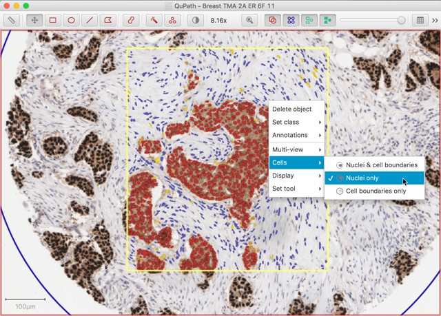
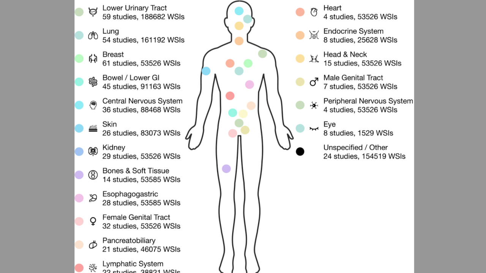

</h1>

    <h1>🧬 PathoAI-Hub（OpenPathoFoundation）</h1>
    
<strong>计算病理学开源生态</strong>

    
聚合 · 导览 · 连接 —— 帮你在最短时间内找到针对某个任务应该用什么模型、工具、数据

  
  
  

---

## 🎯 我们的愿景

**PathoAI-Hub 的价值在于入口而非仓库**——我们帮你筛选、分类、对比，让你在最短时间内找到所需资源并开始使用。

如果本项目能给您带来一点点帮助，麻烦点个 ⭐️ 吧～同时也欢迎大家贡献本项目未收录的开源模型、应用、数据集等。

---

## 📚 四大核心板块

### 🏆 [模型ZOO — 选型指南](model-zoo/)

> 2026年最新的病理大模型你知道吗？一张表告诉你答案

**你能在这里找到：**
- UNI、Virchow、CONCH、Moozy 等 **20+** 开源病理基础模型
- 可横向对比的模型总表：参数量、训练数据、架构、开源情况一目了然
- 按场景推荐：通用特征提取 → UNI · 大参数泛化 → Virchow · 多模态推理 → CONCH

[→ 进入模型ZOO，找到你的模型 →](model-zoo/)

---

### 🛠 [实用工具 & Demo — 开箱即用](tools-demo/)

> 从开源标注平台、到各大厂商SDK、再到一站式分析平台，这里有你需要的全流程工具。

**你能在这里找到：**
-  **全流程平台**：QuPath、HistoColAi、ASAP —— 无需编程即可上手
-  **AI标注工具**：nuclei.io 将诊断时间从 209 秒缩短至 **79 秒**（-62%）
-  **开发框架**：TIAToolbox、PathML、CLAM —— Python 接口，灵活构建
-  **细胞分析**：HoVerNet-PanNuke、StarDist 开箱即用

[→ 进入工具库，发现趁手利器 →](tools-demo/)

---

### 📖 [前沿论文 — 风向标](papers/)

> 精选最有价值的学术论文，看清病理AI的下一步走向。

**你能在这里找到：**
-  **病理基础模型**：UNI、Virchow、CONCH、GPFM 等核心论文追踪
-  **多模态融合**：病理+基因组/转录组联合分析最新进展
- **与模型ZOO双向联动**：ZOO新增模型 → 论文同步解读；论文宏观趋势 → 反哺模型选型理解

<!--  -->

[→ 进入论文库，把握技术脉搏 →](papers/)

---

### 📊 [数据与基准 — 评测基石](data-benchmarks/)

> 筛选有价值的开源数据

**你能在这里找到：**
- 🗂 **10+** 高质量病理数据集：从 PatchCamelyon（32万张图像）到 RuiPath（700张WSI / 7癌种）
- 🏅 标准化基准测试：公平对比算法性能，验证模型泛化能力

[→ 进入数据馆，找到评测基石 →](data-benchmarks/)

---

## 🚀 快速开始

- **🔬 病理医生**：从 [实用工具](tools-demo/) 的 QuPath 或 HistoColAi 开始，无需编程，开箱即用
- **💻 AI研究员**：从 [模型ZOO](model-zoo/) 选预训练模型，用 [数据与基准](data-benchmarks/) 的数据集微调评测
- **📋 产品经理/决策者**：从 [前沿论文](papers/) 把握技术趋势，从 [数据与基准](data-benchmarks/) 评估技术成熟度

---

## 🤝 贡献指南

我们持续收集优质开源资源。欢迎通过 Issue 或 PR 提交：

- 新发布的病理基础模型（附论文链接和开源地址）
- 病理AI开源工具/平台
- 病理相关数据集（附获取方式和使用条款）
- 前沿论文解读

另外微信公众号每日更新AI大模型及各个领域的最新进展，深入解读最新论文与产品，欢迎关注**码科智能**！

---

## 📄 许可

本仓库的元数据（资源索引）采用 [MIT License](LICENSE)。各资源本身的许可请参考其各自的 License 声明。部分数据集（如 RuiPath Benchmark）采用 CC-BY-NC-ND 等限制性许可，使用时请遵守对应条款。
